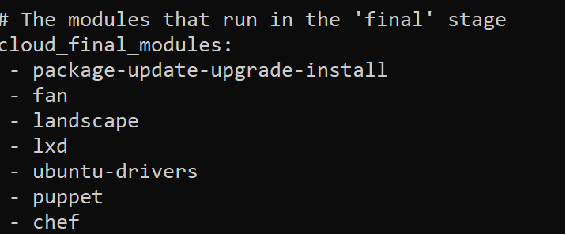
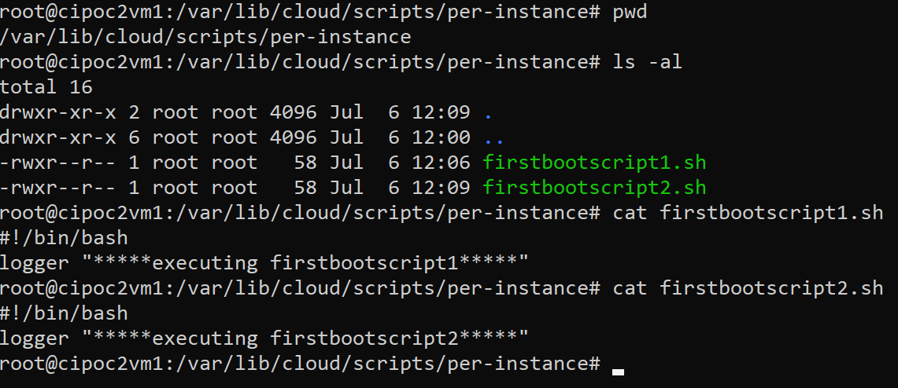
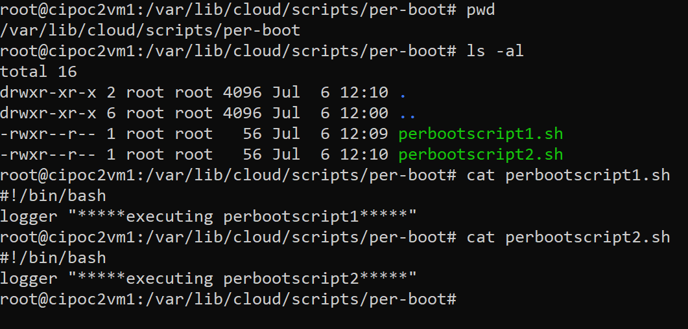
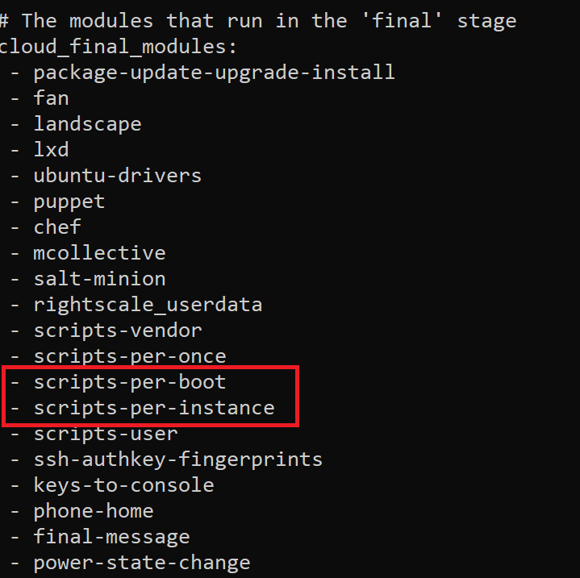
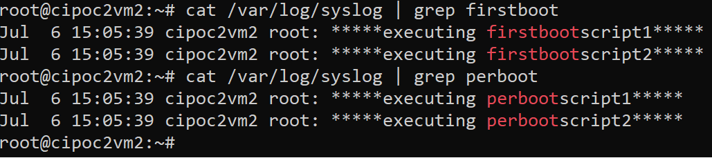
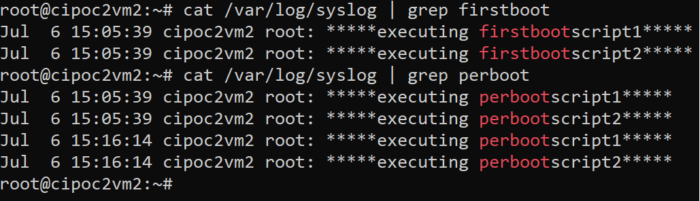

# cloudinitintro

## Problem statement:  
On a new Azure Ubuntu Linux VM (18.04) created from a custom image, is there a way in which we can do the following:  
	1. Run user supplied bash scripts on the very first boot of the VM  
	2. Run user supplied bash scripts on every boot of the VM  
The above two objectives are to be achieved using cloud-init only and the same to be showcased using a simple PoC.  

## Backdrop:
The new VM should be created using a Managed Image in which the bash scripts will already be present. 

## Disclaimer:
I am not an expert on Linux. After digging around the documentation on cloud-init, I found the below approach which I have documented. I am open for any feedback on the current approach or suggestions on an alternative approach.  
Also the explanation in this article is my own version of how I have understood cloud-init.  
The article is not a holistic guide on cloud-init and it just has enough content to understand the PoC which is explained. Official documentation of cloud-init can be found at:  https://cloudinit.readthedocs.io/en/latest/index.html  

## cloud-init description:
It is a method to convert a raw VM on a particular cloud platform to a finished stage with all the desired installers/programs/scripts made available on that VM. This get done during the boot time of the VM. cloud-init can be used with multiple cloud platforms.  
Example: NGINX can be installed on a blank Ubuntu VM using cloud-init.  

## cloud-init key components:
**Who does it:** cloud-init makes use of a bunch of systemd based services to get the job done during the boot time. The below are the systemd services and the same are run in the below mentioned sequence during different stages of boot:  
	a. **cloud-init-generator** (Generator stage)  
	b. **cloud-init-local.service** (Local stage)  
	c. **cloud-init.service** (Network stage)  
	d. **cloud-config.service** (Config stage)  
	e. **cloud-final.service** (Final stage)  
More info here:  https://cloudinit.readthedocs.io/en/latest/topics/boot.html  

**What is to be done:** The cloud-init-generator (point a.) will decide if cloud-init should be included in the boot process. Remaining of the above mentioned services (point b. to point e.) each run a set of modules. Which modules would run in which stage of boot are mentioned in the main configuration file **cloud.cfg** (/etc/cloud/cloud.cfg). Additional configuration is mentioned in the .cfg files present at **/etc/cloud/cloud.cfg.d/**  
More info here: https://cloudinit.readthedocs.io/en/latest/topics/faq.html#where-are-the-configuration-files  

For example, below snippet (partial) from the cloud.cfg file mentions the modules in the Final stage which will be run by the **cloud-final.service**    

    

Some of these modules are capable of running custom scripts of the user. Using cloud-init the custom scripts can be run by using one of the following methods:  
	a. Script passed as **user data a.k.a custom data** during the VM creation. More info here (for Azure): https://docs.microsoft.com/en-us/azure/virtual-machines/linux/tutorial-automate-vm-deployment  
	b. Placing the scripts in one of the sub-directories under **/var/lib/cloud/scripts/**. These scripts are executed by specific modules.  More info here: https://cloudinit.readthedocs.io/en/latest/topics/modules.html#scripts-per-boot  

## Cloudinit modules used for the requirement:
Circling back to the requirement, it is desired to accomplish the following:  
1. Run user supplied bash scripts on the very first boot of the VM  
2. Run user supplied bash scripts on every boot of the VM  
The requirement of my customer was that they wanted to create a Managed Image first which will have the desired bash scripts and other programs. And using this Managed Image, they wanted to create multiple VMs on which the bash scripts would run (first boot or per boot).    

To accomplish the same, the below modules of cloud-init can be used:  
1. **scripts-per-instance:** This module is run in the final stage of the boot process. This module executes the scripts which are present in the directory **/var/lib/cloud/scripts/per-instance** in the alphabetical order when a new VM is first booted.  
2. **scripts-per-boot:** This module is run in the final stage of the boot process. This module executes the scripts which are present in the directory **/var/lib/cloud/scripts/per-boot** in the alphabetical order on every boot of the VM.  
More info here: https://cloudinit.readthedocs.io/en/latest/topics/modules.html#scripts-per-boot  

## PoC description and set up:
The PoC will be created in 2 steps:   
a. First a VM will be created. On that VM, the scripts which are to be executed on the first boot will be created and stored in the directory **/var/lib/cloud/scripts/per-instance/**. Also, the scripts which are to be executed on every boot will be created and stored in the directory **/var/lib/cloud/scripts/per-boot/**. Then an image will be created of this VM.  
b. Using the image created in point a., we create a new VM. And on this new VM, we check if the scripts are getting executed as desired (first boot and per boot).  

### Set up for step a.
First we create a blank Ubuntu 18.04 VM on Azure. More info here: https://docs.microsoft.com/en-us/azure/virtual-machines/linux/quick-create-portal    

After this we create the below 2 bash scripts by the name **firstbootscript1.sh** and **firstbootscript2.sh** in the directory **/var/lib/cloud/scripts/per-instance/**. Both these scripts should be made executeable using **chmod u+x** command.    

    
The scripts will just print the lines in the syslog at **/var/log/syslog** whenever they are executed.    

Then we create the below 2 bash scripts by the name **perbootscript1.sh** and **perbootscript2.sh** in the directory **/var/lib/cloud/scripts/per-boot**.    

    
The scripts will just print the lines in the syslog **/var/log/syslog** whenever they are executed.    

We will also verify that the cloud-init configuration file **cloud.cfg** (/etc/cloud/cloud.cfg) has the modules **scripts-per-instance** and **scripts-per-boot** mentioned as below:    

    

We then create an image of this VM (custom image). More info here (Step 1 and Step 2): https://docs.microsoft.com/en-us/azure/virtual-machines/linux/capture-image  

### Set up for step b.
We then create a new VM from the image created in step a. More info here (Step 3): https://docs.microsoft.com/en-us/azure/virtual-machines/linux/capture-image  

Once the new VM created from the image boots completely, we check the syslog **/var/log/syslog**. We should see the below contents:    

    

Now we reboot the VM from the portal. After the VM reboots, we again check the syslog **/var/log/syslog**. We should see the below contents:    

    

So we see that the print lines from the scripts **firstbootscript1.sh** and **firstbootscript2.sh** are appearing only once.   
However, the lines from the scripts **perbootscript1.sh** and **perbootscript2.sh** are getting printed twice.   
This proves that the scripts in the directory **/var/lib/cloud/scripts/per-instance** are getting executed only during the first boot while those in **/var/lib/cloud/scripts/per-boot** are getting executed on every boot.    
